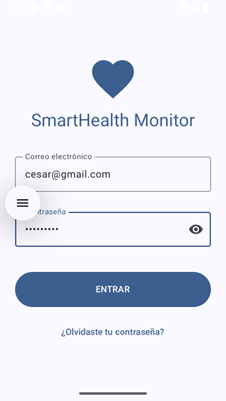
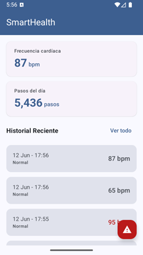
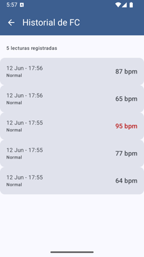
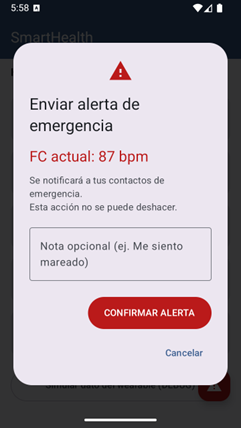

# SmartHealth Monitor

Aplicación Android de monitoreo de salud personal en tiempo real orientada a dispositivos móviles y wearables (Wear OS). Proyecto desarrollado en arquitectura limpia y componentes declarativos nativos.

Desarrollada como proyecto integrador — UTNG 9° Cuatrimestre 2026.

## 🛠️ Stack Tecnológico
| Tecnología | Uso / Aplicación |
|---|---|
| **Kotlin + Jetpack Compose** | Construcción de UI declarativa nativa con Material Design 3. |
| **Wearable Data Layer API** | Canal de comunicación bidireccional mediante Bluetooth Low Energy (BLE). |
| **Health Services API** | Suscripción y lectura al sensor de frecuencia cardíaca continuo en background (Wear OS). |
| **Room Database** | Persistencia local y reactiva de los datos históricos recolectados del reloj. |
| **Jetpack Navigation** | Control de flujos de navegación estructurado por medio de un `NavHost`. |
| **Conventional Commits** | Estandarización estricta del historial de control de versiones. |

## 📱 Arquitectura de Pantallas
| Pantalla | Descripción de Funcionalidades |
|---|---|
| **LoginScreen** | Control de acceso seguro con validaciones de campos de texto en tiempo real. |
| **DashboardScreen** | Panel de control primario que recolecta flujos de datos (`StateFlow`) del Wear OS. |
| **HistorialScreen** | Listado inteligente de lecturas persistidas desde Room usando recolectores reactivos. |
| **AlertaScreen** | Cuadro de diálogo de confirmación Material Design 3 con envío de notas añadidas ante emergencias. |

## 📸 Evidencia de Interfaces (Unidad I)
| Autenticación | Panel Principal |
|--- |--- |
|  |  |

| Historial de Lecturas Room | Confirmación Crítica |
|--- |--- |
|  |  |

## ✒️ Autor
* **César Fernando González Ávalos** - Estudiante de Ingeniería en Desarrollo y Gestión de Software
* *Universidad Tecnológica del Norte de Guanajuato (UTNG)*